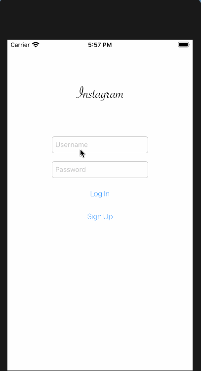
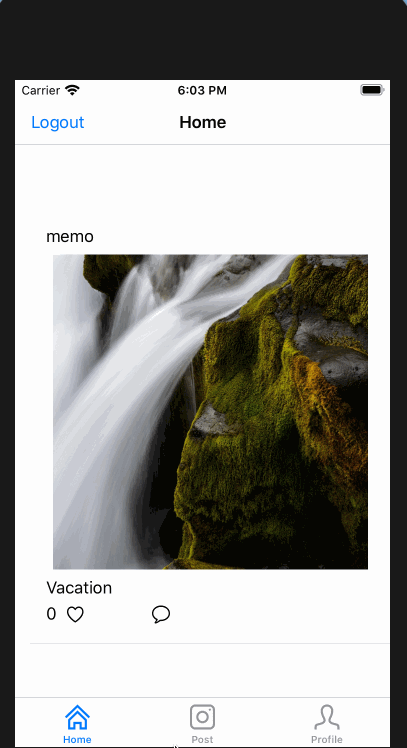
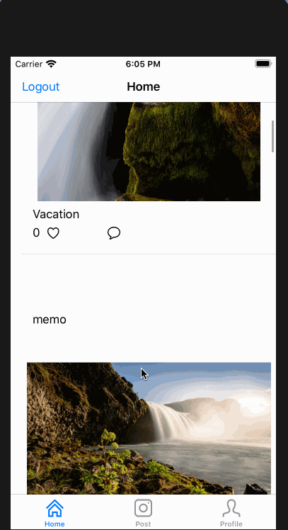

# Project 3 - Instagram

**Instagram** is an iOS app that build an Instagram clone using Parse as the backend.

Time spent: **30** hours spent in total

## User Stories

The following **required** functionality is completed:

- [X] User sees app icon in home screen and styled launch screen.
  - [X] User can sign up to create a new account using Parse authentication
  - [X] User can log in and log out of his or her account
  - [X] The current signed in user is persisted across app restarts
  - [X] User can take a photo, add a caption, and post it to "Instagram"
  - [X] User can view the last 20 posts submitted to "Instagram"
  - [X] User can pull to refresh the last 20 posts submitted to "Instagram"
  - [X] User can tap a post to view post details, including timestamp and caption.
  

The following **optional** features are implemented:

- [X] Run your app on your phone and use the camera to take the photo.
- [ ] Style the feed to look like the real Instagram feed.
- [ ] User can use a tab bar to switch between all "Instagram" posts and posts published only by the user. AKA, tabs for Home Feed and Profile
  - [ ] Style the login page to look like the real Instagram login page.
- [ ] User can load more posts once he or she reaches the bottom of the feed using infinite scrolling.
- [ ] Show the username and creation time for each post
- [ ]  User Profiles
- [ ] User can comment on a post and see all comments for each post in the post details screen.
- [ ] Implement a custom camera view
- [ ] User can like a post and see number of likes for each post in the post details screen.

## Video Walkthrough

Here's a walkthrough of implemented user stories:

GIF created with [LiceCap]

## License

    Copyright [2020] [Guillermo Flores V]

    Licensed under the Apache License, Version 2.0 (the "License");
    you may not use this file except in compliance with the License.
    You may obtain a copy of the License at

        http://www.apache.org/licenses/LICENSE-2.0

    Unless required by applicable law or agreed to in writing, software
    distributed under the License is distributed on an "AS IS" BASIS,
    WITHOUT WARRANTIES OR CONDITIONS OF ANY KIND, either express or implied.
    See the License for the specific language governing permissions and
    limitations under the License.

